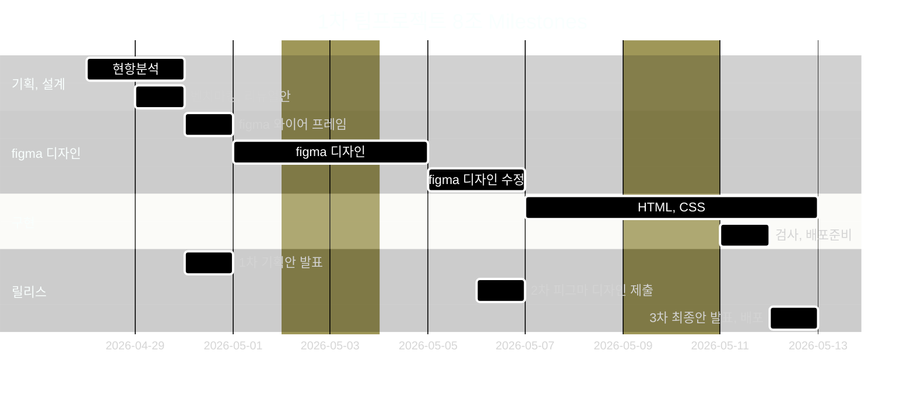

# 1st Team Project 8(1차 프로젝트 8조

- 과정명: 프로젝트기반 프론트엔드 개발자 양성(Figm/HTML/css/JSREACT)
- 기간: 26/04/07 ~ 26/08/21
- 1차 프로젝트: 26/04/30 ~ 26/05/12

## 🔗 빠른 링크

- 📑 기획서(피그마 슬라이드):https://www.figma.com/slides/jpFNlU0RKVM4rKhl0MYZOL
- 🎨 디자인 원본(피그마):https://www.figma.com/design/bVSC0HYCJuuoZ9XzhBBmkM/1%EC%B0%A8--%ED%8C%80-%ED%94%84%EB%A1%9C%EC%A0%9D%ED%8A%B8?node-id=0-1&t=TS6B4cLsRKB0WJRI-1

## 1. 프로젝트 개요

### 1.1 목표

- **개인 작업물 전시**: 프론트엔드 과정 수료 후 제작한 프로젝트와 포트폴리오를 한 곳에 모아 소개
- **실서비스형 구현**: Next.js App Router와 Supabase를 활용한 인증, 데이터 관리, 파일 업로드 기능 포함
- **관리 효율성**: 관리자 로그인 후 포트폴리오 항목 CRUD가 가능하도록 구성
- **배포 경험**: Vercel을 통한 프로덕션 배포 및 CI/CD 경험

### 1.2 👥 팀원

| 이름   | 역할           | 주요 담당                                                                                                                                                           | GitHub                                       | 연락                        |
| ------ | -------------- | ------------------------------------------------------------------------------------------------------------------------------------------------------------------- | -------------------------------------------- | --------------------------- |
| 최호찬 | 팀장 · FE 리드 | 현황분석(웹표준&웹접근성) <br>벤치마킹 (트렌드)<br>section employment/section navigation. Section - Visual References for visual interest, Footer (Shared Component | [@alikerock](https://github.com/alikerock)   | (예) starhochan70@gmail.com |
| 이성희 | FE ·           | 현황분석(반응형)<br>벤치마킹(반응형 웹)<br>HERO section, HERO Mega Menu section, Frontend section                                                                   | [@xoxoworld](https://github.com/xoxoworld)   | sung021125@gmail.com        |
| 맹예진 | FE ·           | 현황분석(경제성)<br>벤치마킹 (비주얼)<br>Section features, Section company, Section differentiation, Section job status, Section portfolio                          | [@jiwoo-park](https://github.com/jiwoo-park) | rkskek8484@gmail.com        |
| 장진혁 | FE ·           | 현황분석(심미성 독창성 ) <br>벤치마킹(UX/UI)<br>Section testimonial, Section lecture, Section Curriculum, Section instructors                                       | [@jiwoo-park](https://github.com/jiwoo-park) | wwwg98@gmail.com            |
| 주성문 | FE ·           | 현황분석(합목적성)<br>벤치마킹(내용)<br>Student Benefits Section, Section - Recruitment Overview, Section - FAQ                                                     | [@jiwoo-park](https://github.com/jiwoo-park) | jiwoo@example.com           |

### 1.3 🗓️ 마일스톤

#### 1~3일차 — 프로젝트 이해 & 환경 세팅

- [ ] 사이트 분석, 현황 체크
- [ ] 벤치 마킹
- [ ] 리뉴얼 개선안 설정
- [ ] 와이어 프레임 생성

#### 4~9일차 — figma 디자인

- [ ] 섹션별 초기 디자인 안을 구성
- [ ] 사용할 폰트, 색상을 style로 지정
- [ ] 각 섹션별 더미 텍스트/이미지 삽입
- [ ] 피드백 후 배치, 디자인 수정

#### 10~15일차 — HTML, CSS 구현

- [ ] GitHub 저장소 생성 및 로컬 환경 연결
- [ ] 공용 CSS, 디자인시안 적용
- [ ] 시맨틱 태그를 사용하여 전체 HTML 골격 작성
- [ ] 각 섹션을 완성, 피드백, 수정을 반복

#### 15일차 — 세부 디자인 반영

- [ ] 웹표준 & 웹접근성 검사 및 수정
- [ ] GitHub Pages 배포 설정 / 공유
- [ ] ReadMe.md 작성
- [ ] 발표 리허설 & Q&A 준비



### 1.5 주요 기능

---

#### 👤 사용자/관리자 관리

- Supabase Auth를 이용한 이메일 기반 로그인
- 관리자 계정만 프로젝트 등록/수정/삭제 가능
- RLS(Row Level Security) 정책 적용

#### 📂 프로젝트 관리

- 프로젝트 등록(제목, 설명, 대표 이미지, 상세 이미지, URL, 리뷰 등)
- 이미지 업로드(Supabase Storage)
- 목록/상세 페이지 구현
- 썸네일과 상세 이미지 구분 저장

#### 🔍 부가 기능

- 검색/필터(기술스택, 카테고리 등)
- 페이지네이션 또는 무한 스크롤
- 반응형 레이아웃(모바일·태블릿·데스크톱 대응)
- SEO 및 OG 태그 자동 생성

---

## 2. 개발 환경 및 배포

### 2.1 개발 스택

#### Frontend

- **Styling**: CSS Modules / Tailwind CSS

#### Tools

- **Version Control**: Git & GitHub

- **Design**: Figma

### 2.2 배포 URL

- **Production**: https://xoxoworld.github.io/EST_fe_13_1st_project/

### 2.3 📚 개발 컨벤션 가이드

프로젝트에서 사용하는 HTML, CSS, JavaScript 작성 규칙은 아래 문서를 참고하세요.

- [HTML 컨벤션](docs/guide_html.md)
- [CSS 컨벤션](docs/guide_css.md)
- [JavaScript 컨벤션](docs/guide_js.md)

---

## 3. 라우팅 구조

| 경로               | 설명                        | 접근 권한 |
| ------------------ | --------------------------- | --------- |
| `/`                | 메인 홈(프로젝트 목록)      | 전체      |
| `/portfolio`       | 포트폴리오 전체 보기        | 전체      |
| `/portfolio/[id]`  | 프로젝트 상세 페이지        | 전체      |
| `/about`           | 자기소개 페이지             | 전체      |
| `/contact`         | 연락 페이지                 | 전체      |
| `/admin/login`     | 관리자 로그인 페이지        | 비로그인  |
| `/admin/dashboard` | 프로젝트 목록/관리 대시보드 | 관리자    |
| `/admin/insert`    | 프로젝트 등록               | 관리자    |
| `/admin/edit/[id]` | 프로젝트 수정               | 관리자    |

```

## 5. 프로젝트 구조

```

EST_fe_13_1st_project/
├─ css/
│  ├─ common.css
│  ├─ flex-utility.css
│  ├─ index.css
│  ├─ normalize.css
│  └─ reset.css
├─ images/
├─ common.html
├─ index.html
└─ readme.md

## 7. 향후 개선 사항

- 프로젝트 검색/필터링 UI
- 이미지 업로드 시 썸네일 자동 생성
- Contact 폼 → Edge Function 메일 발송
- E2E 테스트(Cypress) 및 배포 자동화
- Lighthouse 성능/SEO 90점 이상 달성

## 8. 실행 방법

### 1. 클론

```

git clone https://github.com/xoxoworld/EST_fe_13_1st_project


```

## 10. 제작 후기

이 프로젝트를 통해 Next.js App Router와 Supabase를 결합하여
전체 CRUD 흐름과 배포까지 경험하였으며,
실무에 가까운 BaaS 활용법, 권한 제어, 성능 최적화 과정을 학습하였습니다.

## 11. 기획/디자인 문서

- **기획서(피그마 슬라이드)**: 사용자 여정, 화면 흐름, 요구사항, 마일스톤 정리
  링크: https://www.figma.com/file/XXXX
- **디자인 원본(피그마)**: 컴포넌트, 컬러/타이포 스케일, 반응형 레이아웃, 아이콘
  링크: https://www.figma.com/file/YYYY

### 11.1 미리보기

<!-- /public/readme/ 폴더에 썸네일 PNG를 넣고 경로를 맞춘다 -->

[](https://www.figma.com/file/XXXX "피그마 슬라이드로 이동")
[](https://www.figma.com/file/YYYY "피그마 디자인으로 이동")

### 11.2 버전 메모

- v1.0(2025-08-12): 핵심 화면/플로우 확정
- v1.1(2025-08-15): 모바일 브레이크포인트/컴포넌트 토큰 보강

```

```
